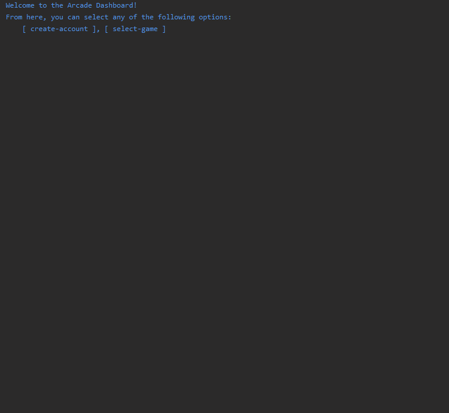

# Casino Simulation

* **Objective** - To create an casino simulation
* **Purpose** - To gain familiarity with general object orientation and design principles

* **Description**
    * View the [javadocs](https://zipcoder.github.io/maven_simple-casino/docs/index.html) for the program to become better oriented with its design
      * `https://zipcoder.github.io/maven.simple-casino/docs/index.html`
    * Create a casino simulation by extending or removing the pre-built implementations.
    * It is advised that you create additional methods and classes to mediate any foreseen shortcomings of the prebuilt assets. 
    * Enforce the following features in your system:
        * Ensure a console-based interface is available to allow input from and output to the users
        * Ensure the `Casino` has a selection of at least 2 implementation of `GameInterface`.
        * Ensure all implementation of `PlayerInterface` have reference to a `CasinoAccount`
        * Ensure `PlayerInterface` is garbage collected upon completing a respective `GameInterface`
            * `BlackJackPlayer` should be garbage collected when `BlackJackGame` is completed
            * `SlotsPlayer` should be garbage collected when `SlotsGame` is completed
        * Ensure at least 5 different implementations of `GameInterface` and a respective `PlayerInterface` are defined.
        * Ensure there are at least 80% line coverage from testing the application.
    * Please begin by implementing the `SlotsGame`, `SlotsPlayer` as well as `NumberGuessGame` and `NumberGuessPlayer` provided in the `com.github.zipcodewilmington.casino.games` package. 

## How to Download

#### Part 1 - Forking the Project
* To _fork_ the project, click the `Fork` button located at the top right of the project.

#### Part 2 - Navigating to _forked_ Repository
* Navigate to your github profile to find the _newly forked repository_.
* Copy the URL of the project to the clipboard.

#### Part 3 - Cloning _forked_ repository
* Clone the repository from **your account** into the `~/dev` directory.
  * if you do not have a `~/dev` directory, make one by executing the following command:
    * `mkdir ~/dev`
  * navigate to the `~/dev` directory by executing the following command:
    * `cd ~/dev`
  * clone the project by executing the following command:
    * `git clone https://github.com/MYUSERNAME/NAMEOFPROJECT`

#### Part 4 - Check Build
* Ensure that the tests run upon opening the project.
    * You should see `Tests Failed: ${number-of-tests} of ${number-of-tests} tests`
* Execute the command below to run JUnit tests from the command line. 
    * `mvn package -Dmaven.test.failure.ignore=true`

## How to Submit

#### Part 1 -  _Pushing_ local changes to remote repository
* from a _terminal_ navigate to the root directory of the _cloned_ project.
* from the root directory of the project, execute the following commands:
    * add all changes
      * `git add .`
    * commit changes to be pushed
      * `git commit -m 'I have added changes'`
    * push changes to your repository
      * `git push -u origin master`

#### Part 2 - Submitting assignment
* from the browser, navigate to the _forked_ project from **your** github account.
* click the `Pull Requests` tab.
* select `New Pull Request`
